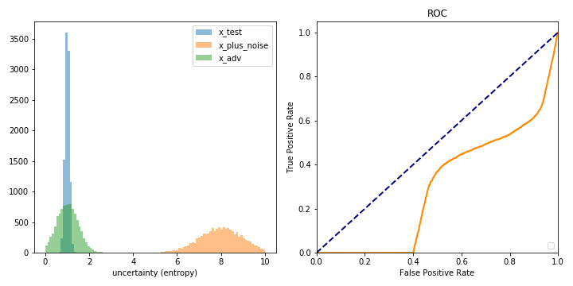

# Histograms and ROC curves
This folder contains a notebook for easy plotting of simulated entropy values. The parameters of the distributions and the adversarial example success rate etc. can be set.

Example:

